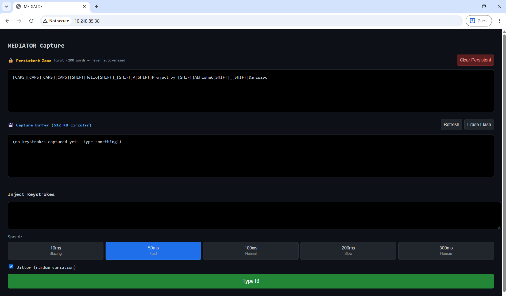
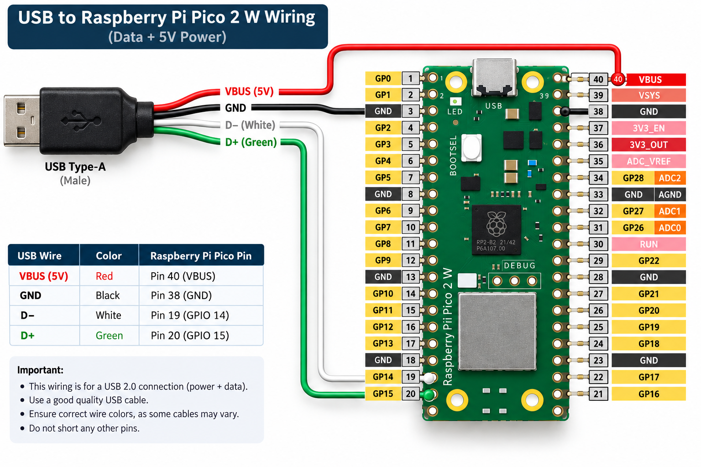

<div align="center">

# 🔴 MEDIATOR

### *USB HID Keyboard Interceptor for Red Team Engagements*

[](https://www.raspberrypi.com/products/raspberry-pi-pico-2-w/)
[](https://en.wikipedia.org/wiki/C_(programming_language))
[](LICENSE)
[]()

</div>

---

> [!CAUTION]
> ## ⚠️ FOR AUTHORIZED RED TEAMING & SECURITY RESEARCH ONLY
>
> **MEDIATOR is a hardware keylogger and remote keystroke injector.**
>
> This device is capable of silently capturing every keystroke typed on a target keyboard and remotely typing arbitrary text into any target machine — completely invisibly, masquerading as the legitimate keyboard.
>
> **Using this device without explicit written authorization from the system/network owner is illegal and unethical.** This project exists solely for:
> - **Authorized Red Team engagements** (physical penetration testing)
> - **Security Research** in controlled lab environments
> - **Educational purposes** to understand HID-layer attack surfaces
>
> The author assumes **zero liability** for any misuse. You are solely responsible for how you use this tool.

---

> [!IMPORTANT]
> **Wi-Fi Credentials are REDACTED in this repo.** Before building, open `src/wifi_server.c` and replace `REDACTED_SSID` and `REDACTED_PASSWORD` with your own hotspot credentials.

---

<div align="center">

## 🎯 What is MEDIATOR?

</div>

MEDIATOR is a stealthy, hardware-level **USB HID man-in-the-middle** device built on the Raspberry Pi Pico 2 W. It physically sits in-line between a target keyboard and a target PC — completely transparent to the user.

```
 ⌨️  Physical Keyboard
        │
        │  USB-A (PIO-USB Host)
        ▼
 ┌──────────────────────────────┐
 │      Raspberry Pi Pico 2 W   │
 │                              │
 │  Core 1 ──► USB Host (PIO)  │  ← intercepts all keystrokes
 │  Core 0 ──► USB Device      │  ← forwards spoofed HID to PC
 │           ► Flash Logger     │  ← silently logs everything
 │           ► Wi-Fi Server     │  ← live dashboard in your browser
 │           ► Key Injector     │  ← types remotely, invisibly
 └──────────────────────────────┘
        │
        │  Native USB (spoofed as real keyboard VID/PID)
        ▼
 🖥️  Target PC
        
        │  Wi-Fi (CYW43439)
        ▼
 🌐  Your Browser → http://<pico-ip>
```

---

## 🔥 Core Capabilities

| Capability | Description |
|:---:|:---|
| 🕵️ **Hardware Keylogger** | Silently captures **every keystroke** - letters, modifiers, special keys, CAPS LOCK state - logged to flash memory that **survives reboots** |
| ⌨️ **Remote Key Injector** | Type any text into the target PC **remotely via a browser** - with speed control and human-like jitter to defeat typing pattern detection |
| 👻 **Identity Spoofing** | Reads the real keyboard's USB VID, PID, Manufacturer & Product string, then re-enumerates to the PC as **that exact keyboard** - Pico is invisible |
| 💾 **Persistent Flash Storage** | 512 KB reserved flash split 50:50 between a **permanent zone** (never auto-erased) and a **circular rolling buffer** - data never lost on power-off |
| 📡 **Live Wi-Fi Dashboard** | Serves a web UI over Wi-Fi with live keystroke view, status indicators, erase controls, and the injection panel |
| 🔄 **Zero-Lag Bridging** | Keystroke forwarding runs on a dedicated core (Core 1) so capture and Wi-Fi overhead **never cause latency** to the user |

---

## 🧠 How It Works (Attack Flow)

```
  [Physical Keyboard]
        │ plugs into
  [MEDIATOR Pico 2W]   ◄──── Attacker connects to Pico's Wi-Fi dashboard
        │ enumerates as  
  [Target PC]          ◄──── PC sees only the real keyboard (spoofed VID/PID)
```

1. **Plug in** - MEDIATOR sits between the keyboard and PC. The PC re-enumerates it as the exact same keyboard (spoofed identity).
2. **Capture** - Every HID report (keypress) is intercepted, decoded, and logged to flash. CAPS LOCK state, modifiers, and all special keys are captured with correct case tracking.
3. **Exfiltrate** - Connect to the Pico's Wi-Fi hotspot from any device. Navigate to `http://<pico-ip>` to view the live keystroke log.
4. **Inject** - From the same dashboard, type any text remotely. The Pico sends it as real HID keystrokes to the target PC.

---

## 📋 Logged Key Reference

All special keys are stored as readable tags in the log. Case is tracked natively - CAPS LOCK state is internally tracked so uppercase/lowercase is always correct in the raw log.

| Key | Logged As | Key | Logged As |
|---|---|---|---|
| Enter | `↵ (newline)` | Escape | `[ESC]` |
| Backspace | `[BS]` | Tab | `[TAB]` |
| Shift | `[SHIFT]` | Ctrl | `[CTRL]` |
| Alt | `[ALT]` | Win / GUI | `[WIN]` |
| Caps Lock | `[CAPS]` | Delete | `[DEL]` |
| Insert | `[INS]` | Home / End | `[HOME]` `[END]` |
| Page Up/Down | `[PGUP]` `[PGDN]` | Arrow Keys | `[UP]` `[DOWN]` `[LEFT]` `[RIGHT]` |
| Function Keys | `[F1]` — `[F12]` | | |

---

## 💾 Flash Memory Layout

```
  4MB Flash (Pico 2W)
  ├── [ Firmware & Code       ] ← 0x000000 – 0x37DFFF  (3.484 MB)
  ├── [ Config Sector   4 KB  ] ← 0x37E000             (write pointers, survives reboot)
  ├── [ Persistent Zone 256KB ] ← 0x37F000             (50% — NEVER auto-erased)
  └── [ Circular Buffer 256KB ] ← 0x3BF000             (50% — overwrites oldest data)
```

- **Persistent Zone** - First bytes typed go here and are **never overwritten** automatically. Reserved for capturing high-value data at the start of a session (passwords, login sequences, etc.)
- **Circular Buffer** - Once the persistent zone is full, all subsequent keystrokes go into this rolling buffer. When full, it wraps and overwrites the oldest data.
- Both zones **survive power cuts and reboots** completely.

---

## 🖥️ Web Dashboard

Navigate to `http://<pico-ip>` from any browser on the same Wi-Fi network.



The dashboard provides:
- 🔒 **Persistent Zone viewer** - Shows the reserved never-erased log
- 💾 **Capture Buffer viewer** - Shows the rolling circular log  
- 📊 **Live status bar** - Keyboard connected, USB enumerated, Wi-Fi status, Inject active
- 🗑️ **Clear controls** - Erase flash independently per zone
- ⌨️ **Injection panel** - Type text remotely with speed control

### Injection Speed Settings

| Speed | Delay per Key |
|:---:|:---:|
| ⚡ Blazing | 10 ms |
| 🔵 Fast | 50 ms |
| 🟢 Normal | 100 ms |
| 🟡 Slow | 200 ms |
| 🤖 Human | 300 ms + random jitter |

---

## 🔧 Hardware

| Component | Details |
|---|---|
| **Board** | Raspberry Pi Pico 2 W (RP2350) |
| **Target keyboard** | Any standard USB HID keyboard |
| **To PC** | Pico's own USB port (native USB device) |
| **To keyboard** | USB-A female breakout (PIO-USB host) |

### Wiring



| USB Wire Color | Signal | Pico Pin |
|:---:|:---:|:---:|
| 🔴 Red | VBUS (5V) | **Pin 40 (VBUS)** |
| ⚫ Black | GND | **Pin 38 (GND)** *(or any GND pin)* |
| ⚪ White | D- | **Pin 19 (GPIO 14)** |
| 🟢 Green | D+ | **Pin 20 (GPIO 15)** |

---

## 🏗️ Project Structure

```
MEDIATOR/
├── src/
│   ├── main.c               # Core 0 loop: USB device, Wi-Fi, injection orchestration
│   ├── hid_bridge.c/.h      # Lock-free ring buffer bridging Core 0 ↔ Core 1
│   ├── capture.c/.h         # Flash-backed keystroke logger (persistent + circular)
│   ├── inject.c/.h          # Remote keystroke injection engine
│   ├── wifi_server.c/.h     # Async Wi-Fi + lwIP HTTP server + live dashboard HTML
│   ├── usb_descriptors.c/.h # Dynamic USB descriptor spoofing (VID/PID/strings)
│   ├── tusb_config.h        # TinyUSB config (pure HID, no CDC)
│   └── lwipopts.h           # lwIP tuning (TCP buffer sizes, memory)
├── CMakeLists.txt            # CMake build definition
├── build_and_flash.ps1       # One-click build + flash script (Windows)
├── WALKTHROUGH.md            # Detailed technical internals reference
└── README.md                 # This file
```

---

## 🚀 Building & Flashing

### Prerequisites

- **Pico SDK 2.1.0+**
- **ARM GCC** (`arm-none-eabi-gcc`)
- **CMake** + **Ninja**

On Windows, use the official [Pico Setup for Windows](https://github.com/raspberrypi/pico-setup-windows) installer — it sets up everything automatically.

### Step 1 — Configure Wi-Fi

Edit `src/wifi_server.c`:
```c
#define WIFI_SSID     "YourHotspotName"
#define WIFI_PASSWORD "YourPassword"
```

> [!WARNING]
> **Never commit real credentials to a public repo.** The repo defaults are `REDACTED_SSID` / `REDACTED_PASSWORD` deliberately.

### Step 2 — Build (Windows one-click)

```powershell
git clone https://github.com/Abhishek-Dirisipo/MEDIATOR.git
cd MEDIATOR
.\build_and_flash.ps1
```

### Step 3 — Flash to Pico

1. **Unplug** the Pico.
2. **Hold BOOTSEL** (the small white button on the board).
3. **Plug in** via USB while holding BOOTSEL.
4. **Release** the button — a drive called `RPI-RP2` will appear.
5. The script auto-detects it and copies `bridge.uf2`. The Pico reboots automatically.

### Manual Build (Linux / macOS)

```bash
mkdir build && cd build
cmake ..
make -j$(nproc)
# Copy bridge.uf2 to the mounted RPI-RP2 drive
```

---

## ⚙️ Architecture Deep Dive

```
Core 1 (USB Host — PIO-USB, timing-critical)
  └── tuh_task()
        └── tuh_hid_report_received_cb()
              ├── bridge_push_report()    → shared ring buffer → Core 0
              └── capture_record_report() → flash logger

Core 0 (USB Device + Wi-Fi + everything else)
  ├── tud_task()           → USB HID device (spoofed keyboard to PC)
  ├── bridge_task()        → pops ring buffer → sends to PC via HID
  ├── capture_task()       → flushes RAM buffer to flash (5s inactivity timer)
  ├── inject_task()        → timed keystroke injection from dashboard
  └── wifi_server_task()   → lwIP + HTTP server + /api/status polling

Flash
  ├── Config Sector (4KB)  → write pointers, persistent across reboots
  ├── Persist Zone (256KB) → never auto-erased, first-in data
  └── Circular Zone (256KB)→ rolling overwrite when full
```

---

## 📄 License

MIT — do whatever you want with it, responsibly.

---

<div align="center">

**Built for the curious, the researchers, and the authorized.**

*Not for the malicious.*

</div>
